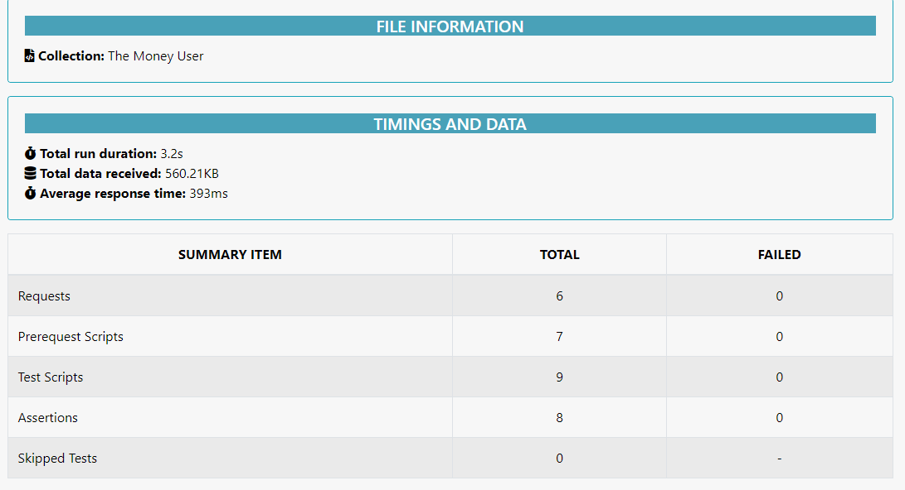

# The-money-API-testing-newman

## The money user API testing project is done by postman and report generated by newman

### **Assignment API testing with Postman**

- #### 01 [API testing Postman Collection](https://www.getpostman.com/collections/4368ea8fe8fa38d5428e)

- #### 02 [API testing Postman Documentation](https://documenter.getpostman.com/view/21091753/UzBsHPa3)

### **How to run this project**

- #### 01 Clone this project

- #### 02 Open with any code editor (Ex-VS Code) and open terminal inside the project folder

- #### 03 Give the following command

- #### 04 only run collection json file you should following the command below

- #### 05 npm install/ npm i or yarn install

- #### 06 npx newman run .collection/assignment-api.json

- #### 07 npm test or yarn test

- #### **Reports Preview Below**

